#### 使用说明

- 初始界面

  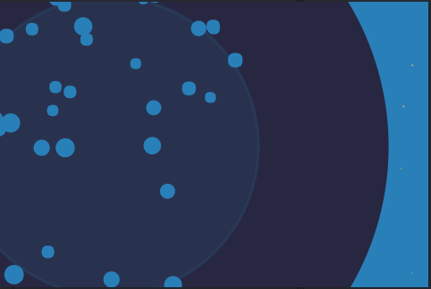

  等待3秒或更久等待资源加载完毕后进入程序主界面

- 程序主界面

  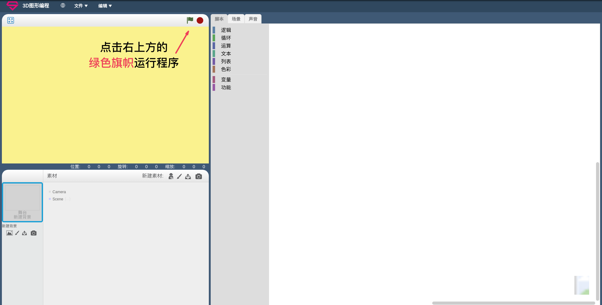

  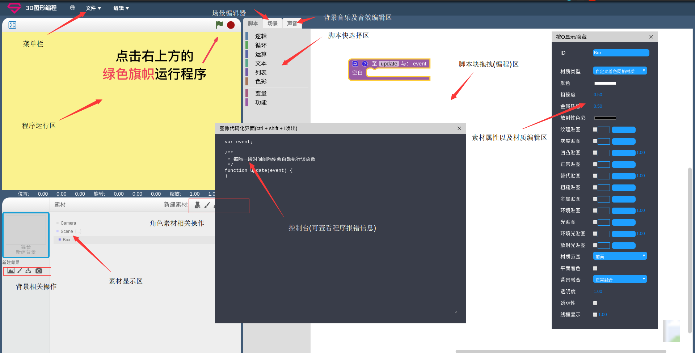

- 新建项目

  点击菜单栏文件选项，选择新建项目

  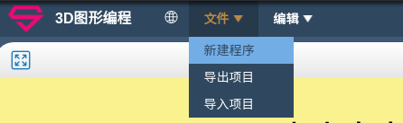

  然后会得到一个初始化的场景，以及一个相机

  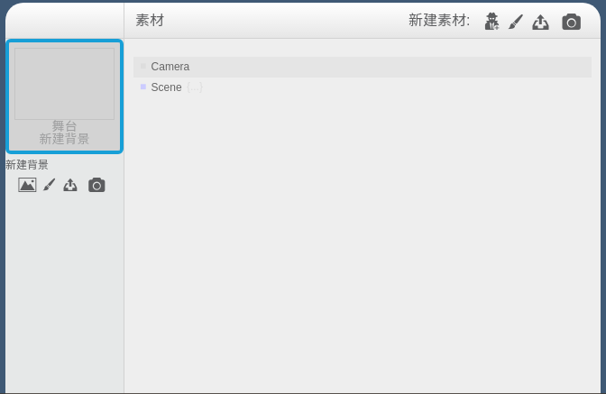

  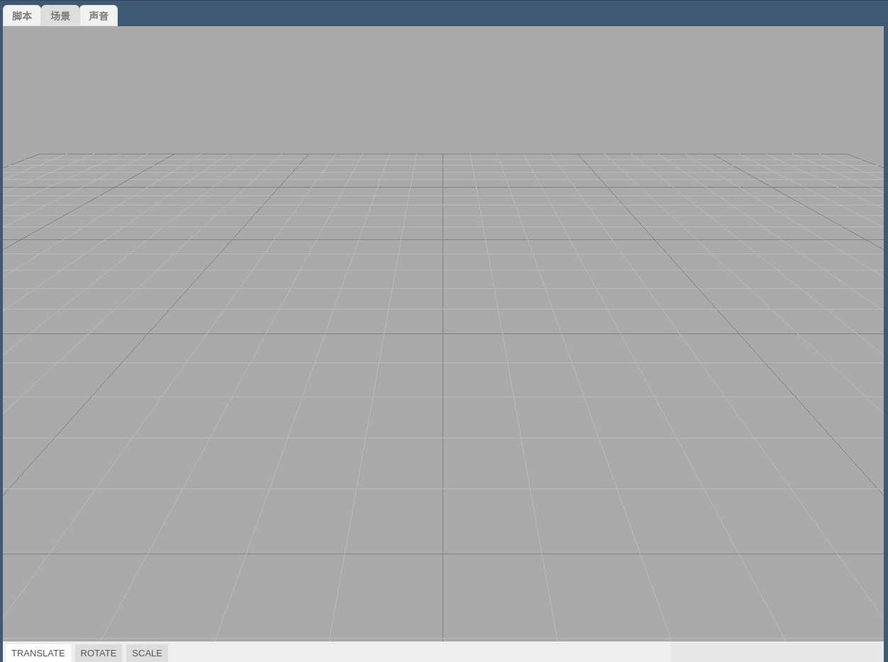

- 添加素材(角色)到场景中

  点击相应图标

  

  在素材库中选择想要添加的素材， 现在提供的素材类型有限

  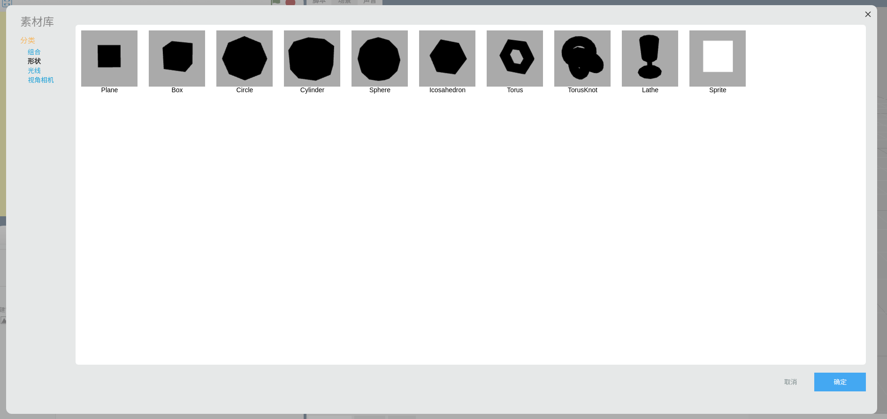

- 编辑素材

  新建的角色或素材可以在素材显示区和场景中看到对应的抽象以及3D对象

  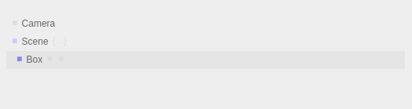

  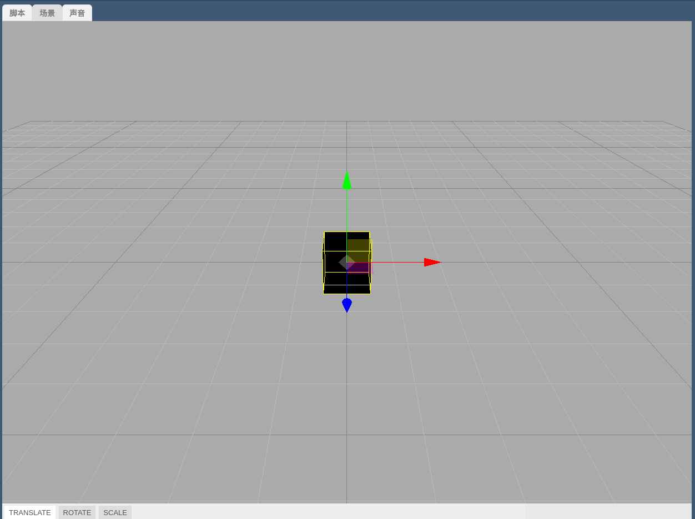

  在素材显示区中按下键盘O键，即可打开素材属性编辑界面

  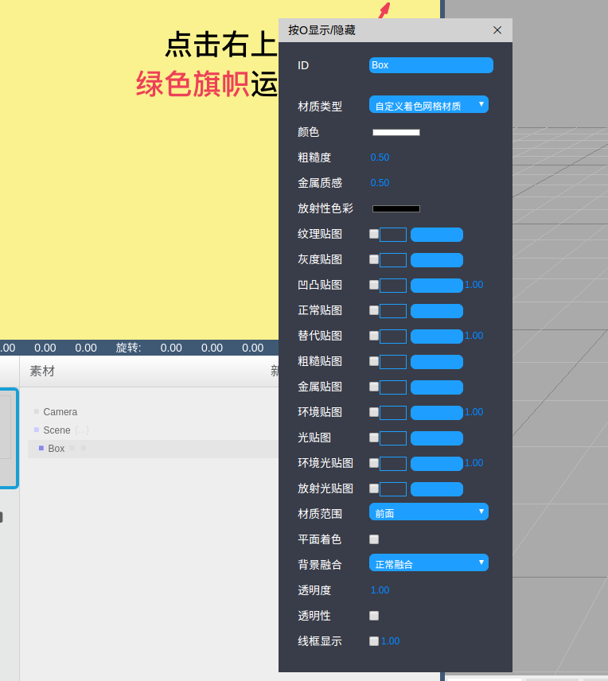

  这里选择最简单的素材为例

  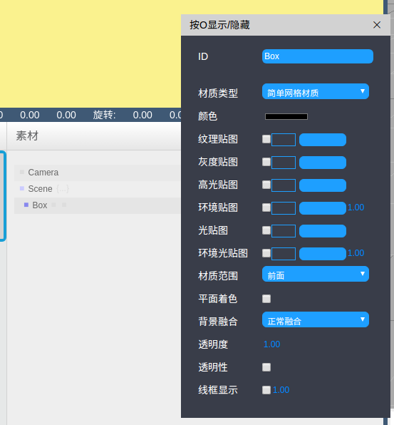

- 编写脚本

  点击脚本按钮，编辑素材对应的脚本

  

  可以看到，初始化的脚本区域中有一个update功能函数， 这个函数提供的作用是，使的函数中的代码能够以60fps的速率不断的重复执行， 省去了用户自己编写帧动画的烦恼

  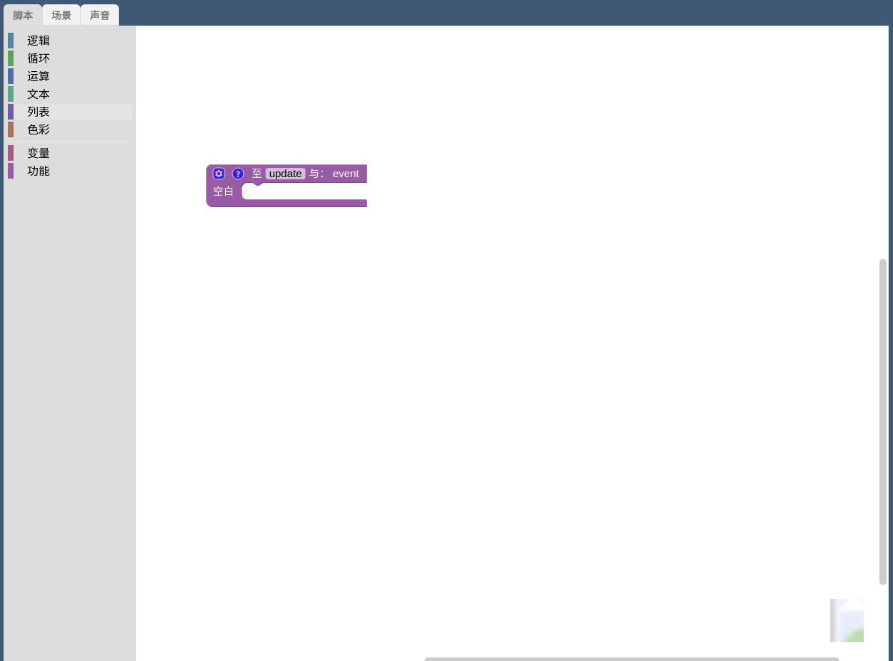

  通过拖拽左侧的脚本块在右边的脚本区域进行组合，可以产生对应的功能代码， 可以通过按下ctrl + shift + I 查看由脚本块编译而成的抽象代码， 这里写一个简单的旋转案例

  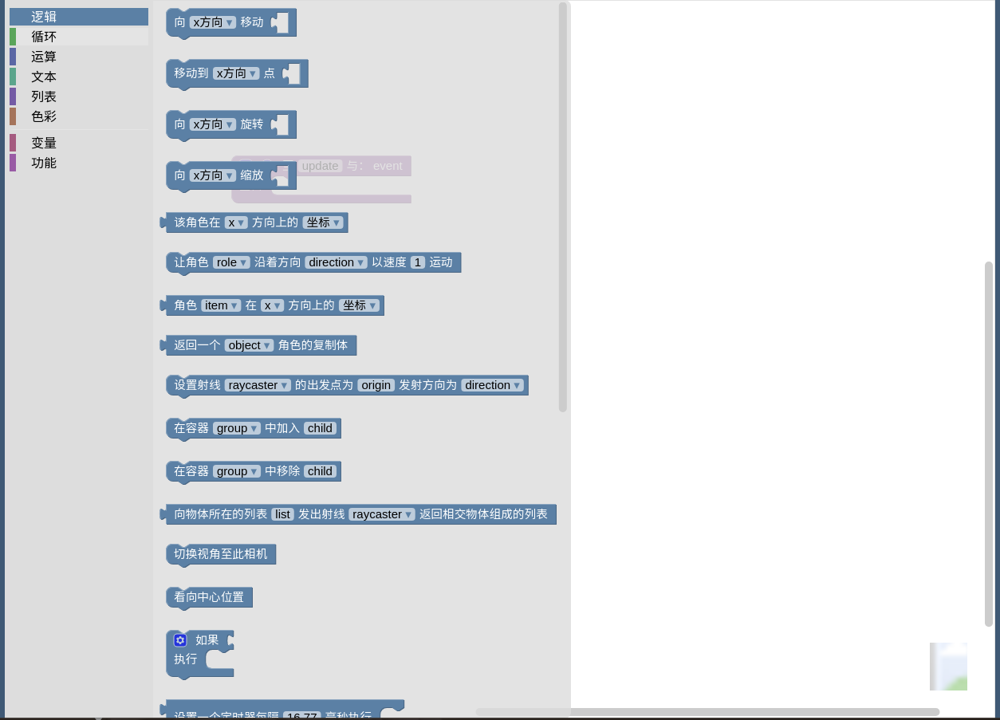

  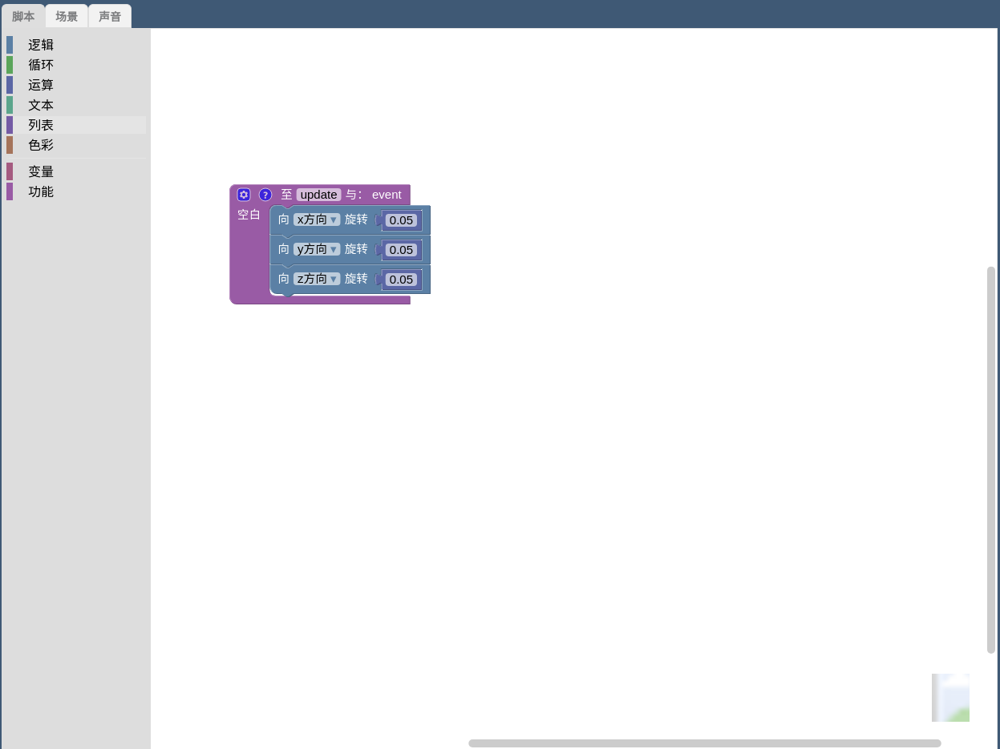

  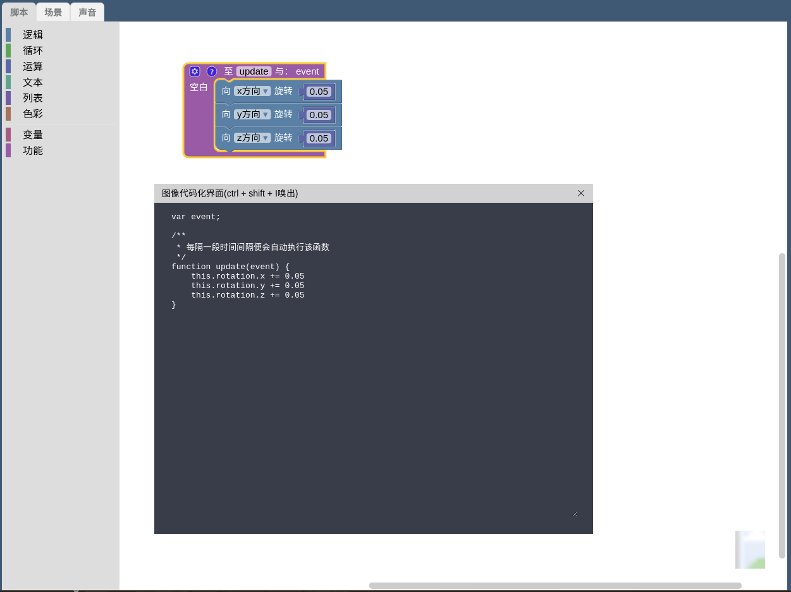

- 运行程序

  编写完相应的脚本后，点击运行区域的绿色旗帜开始运行脚本

  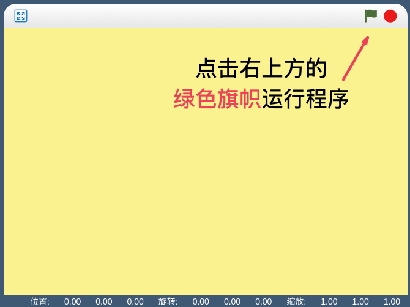

- 运行结果

  运行结果如图

  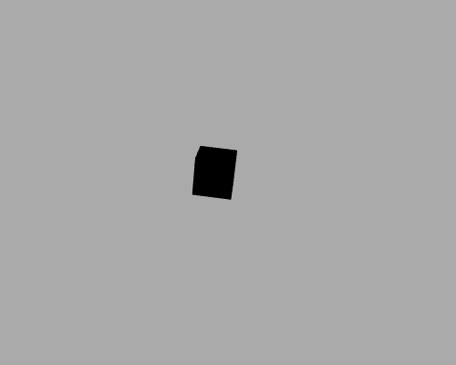
